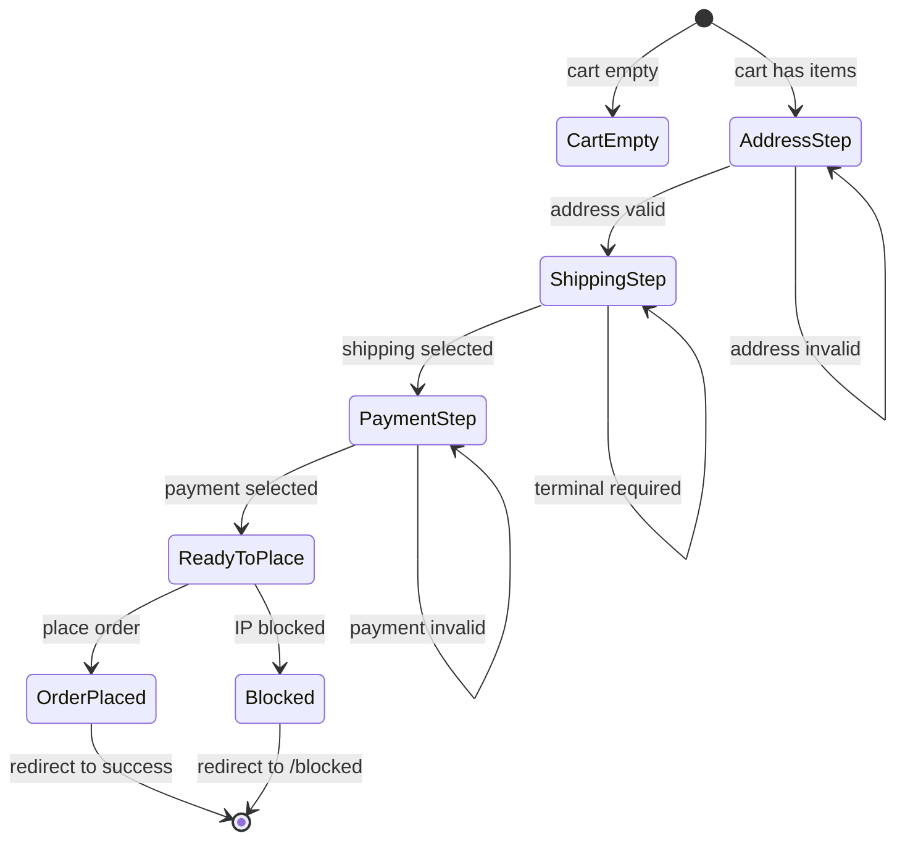

# Checkout MVP Implementation Plan

## Overview

This document outlines the implementation plan for the Checkout MVP based on the ZenFlow blueprint specification. The checkout will support both guest and authenticated users, with shipping method selection, terminal pickup selection, payment method selection, and order placement.

## Current State Analysis

### Existing Components
- [`web/app/checkout/page.tsx`](web/app/checkout/page.tsx) - Basic checkout page with shipping method and terminal selection
- [`web/components/checkout/shipping-method-selector.tsx`](web/components/checkout/shipping-method-selector.tsx) - Shipping method selection component
- [`web/components/checkout/terminal-picker.tsx`](web/components/checkout/terminal-picker.tsx) - Terminal picker with map/list views
- [`web/components/checkout/terminal-map.tsx`](web/components/checkout/terminal-map.tsx) - Leaflet map for terminal selection

### Existing Backend
- [`internal/modules/orders/http.go`](internal/modules/orders/http.go) - Basic `/checkout` endpoint that creates order from cart
- [`internal/modules/cart/http.go`](internal/modules/cart/http.go) - Cart management endpoints
- [`internal/modules/shipping/http_storefront.go`](internal/modules/shipping/http_storefront.go) - Shipping options and terminals endpoints
- [`internal/storage/orders/store.go`](internal/storage/orders/store.go) - Order storage with `customer_id` support

### Missing Components
1. **Frontend**: Address form, payment method selector, billing toggle, order summary, 2-column layout
2. **Backend**: Checkout session state, address validation, quote calculation, payment method handling
3. **Database**: Order shipping/payment fields, checkout sessions table

---

## Architecture

### State Machine

```
[Cart] -> [Address] -> [Shipping] -> [Payment] -> [Place Order] -> [Success]
   |         |            |             |              |
   v         v            v             v              v
 empty    invalid      no-methods    invalid        blocked
```

### Checkout State Flow



---

## Implementation Steps

### Phase 1: Frontend Components

#### 1.1 useCheckoutState Hook

Create centralized state management hook at [`web/hooks/use-checkout-state.ts`](web/hooks/use-checkout-state.ts):

```typescript
type CheckoutState = {
  // Steps
  currentStep: 'address' | 'shipping' | 'payment' | 'review';
  
  // Address
  shippingAddress: Address | null;
  billingAddress: Address | null;
  useSameAsBilling: boolean;
  
  // Shipping
  selectedMethod: ShippingMethod | null;
  selectedTerminal: Terminal | null;
  shippingCountry: string;
  
  // Payment
  selectedPaymentMethod: PaymentMethod | null;
  
  // Cart
  cart: Cart | null;
  
  // Computed
  canProceedToShipping: boolean;
  canProceedToPayment: boolean;
  canPlaceOrder: boolean;
  
  // Actions
  setShippingAddress: (address: Address) => void;
  setBillingAddress: (address: Address) => void;
  setUseSameAsBilling: (value: boolean) => void;
  selectShippingMethod: (method: ShippingMethod) => void;
  selectTerminal: (terminal: Terminal) => void;
  selectPaymentMethod: (method: PaymentMethod) => void;
  placeOrder: () => Promise<void>;
  
  // Loading states
  isLoadingQuote: boolean;
  isPlacingOrder: boolean;
  error: string | null;
};
```

#### 1.2 AddressSection Component

Create at [`web/components/checkout/address-section.tsx`](web/components/checkout/address-section.tsx):

- For authenticated users: Show saved addresses with option to add new
- For guests: Show address form
- Required fields: full_name, address1, city, postcode, country, phone
- Optional fields: address2, state, company_name

#### 1.3 PaymentMethodSelector Component

Create at [`web/components/checkout/payment-method-selector.tsx`](web/components/checkout/payment-method-selector.tsx):

- Mock payment methods: card, banklink, cash_on_delivery
- Card form placeholder (not functional for MVP)
- Banklink provider logos

#### 1.4 BillingToggle Component

Create at [`web/components/checkout/billing-toggle.tsx`](web/components/checkout/billing-toggle.tsx):

- Toggle: "Same as shipping address" (default: true)
- When false: Show billing address form
- Company details section: company_name, VAT number, invoice email

#### 1.5 OrderSummary Component

Create at [`web/components/checkout/order-summary.tsx`](web/components/checkout/order-summary.tsx):

- Cart items list with quantities and prices
- Subtotal, shipping cost, total
- Sticky on desktop (right column)
- Collapsible on mobile

#### 1.6 UpsellSection Component

Create at [`web/components/checkout/upsell-section.tsx`](web/components/checkout/upsell-section.tsx):

- Mock upsell products
- "Add to order" button (non-functional for MVP)

#### 1.7 Checkout Page Layout

Refactor [`web/app/checkout/page.tsx`](web/app/checkout/page.tsx):

```tsx
// Desktop: 2-column layout (60/40)
// Mobile: 1-column with sticky summary at bottom

<div className="grid grid-cols-1 lg:grid-cols-5 gap-8">
  {/* Left column - 60% */}
  <div className="lg:col-span-3 space-y-6">
    <AddressSection />
    <ShippingMethodSelector />
    {requiresTerminal && <TerminalPicker />}
    <PaymentMethodSelector />
    <BillingToggle />
    <UpsellSection />
  </div>
  
  {/* Right column - 40% */}
  <div className="lg:col-span-2">
    <div className="lg:sticky lg:top-4">
      <OrderSummary />
      <PlaceOrderButton />
    </div>
  </div>
</div>
```

---

### Phase 2: Backend Endpoints

#### 2.1 Checkout Module Structure

Create [`internal/modules/checkout/`](internal/modules/checkout/) module:

```
internal/modules/checkout/
  module.go           # Module registration
  http.go             # HTTP handlers
  session.go          # Session management
```

#### 2.2 API Endpoints

| Endpoint | Method | Description |
|----------|--------|-------------|
| `/checkout/quote` | POST | Calculate shipping costs and totals |
| `/checkout/address` | POST | Save shipping/billing address |
| `/checkout/select-shipping` | POST | Select shipping method and terminal |
| `/checkout/select-payment` | POST | Select payment method |
| `/checkout/place-order` | POST | Create order and return payment URL |

#### 2.3 Quote Endpoint

```go
// POST /checkout/quote
// Request:
{
  "country": "EE",
  "cart_value": 5000,  // optional, from cart
  "cart_weight_kg": 1.5  // optional
}

// Response:
{
  "zone": { "id": "...", "name": "Baltics" },
  "methods": [
    {
      "id": "...",
      "title": "Omniva Parcel Terminal",
      "price": 350,
      "currency": "EUR",
      "requires_terminal": true,
      "provider_key": "omniva"
    }
  ],
  "totals": {
    "subtotal": 5000,
    "shipping": 0,  // not selected yet
    "total": 5000
  }
}
```

#### 2.4 Address Endpoint

```go
// POST /checkout/address
// Request:
{
  "shipping": {
    "full_name": "John Doe",
    "address1": "Main Street 1",
    "address2": "",
    "city": "Tallinn",
    "postcode": "10111",
    "country": "EE",
    "phone": "+37212345678",
    "state": ""
  },
  "billing": null,  // or billing address object
  "use_same_as_billing": true,
  "company": null  // or { "name": "...", "vat": "...", "invoice_email": "..." }
}

// Response:
{
  "valid": true,
  "address_id": "uuid"  // for authenticated users, saved to profile
}
```

#### 2.5 Select Shipping Endpoint

```go
// POST /checkout/select-shipping
// Request:
{
  "method_id": "uuid",
  "terminal_id": "uuid"  // required if method requires terminal
}

// Response:
{
  "success": true,
  "shipping_price": 350,
  "currency": "EUR",
  "totals": {
    "subtotal": 5000,
    "shipping": 350,
    "total": 5350
  }
}
```

#### 2.6 Select Payment Endpoint

```go
// POST /checkout/select-payment
// Request:
{
  "method": "card" | "banklink" | "cash_on_delivery",
  "provider": "stripe" | "maksekeskus"  // optional
}

// Response:
{
  "success": true
}
```

#### 2.7 Place Order Endpoint

```go
// POST /checkout/place-order
// Request: {}  // all data from session

// Response:
{
  "order_id": "uuid",
  "order_number": "ORD-20260222-123456",
  "checkout_url": "https://payment.provider.com/checkout/...",
  "status": "pending_payment"
}
```

---

### Phase 3: Database Changes

#### 3.1 Migration: Order Shipping/Payment Fields

Create [`migrations/021_order_shipping_payment.sql`](migrations/021_order_shipping_payment.sql):

```sql
-- +goose Up
-- Add shipping info to orders
ALTER TABLE orders ADD COLUMN IF NOT EXISTS shipping_method_id uuid REFERENCES shipping_methods(id);
ALTER TABLE orders ADD COLUMN IF NOT EXISTS shipping_terminal_id text;
ALTER TABLE orders ADD COLUMN IF NOT EXISTS shipping_price_cents integer NOT NULL DEFAULT 0;

-- Add shipping address columns
ALTER TABLE orders ADD COLUMN IF NOT EXISTS shipping_full_name text;
ALTER TABLE orders ADD COLUMN IF NOT EXISTS shipping_phone text;
ALTER TABLE orders ADD COLUMN IF NOT EXISTS shipping_address1 text;
ALTER TABLE orders ADD COLUMN IF NOT EXISTS shipping_address2 text;
ALTER TABLE orders ADD COLUMN IF NOT EXISTS shipping_city text;
ALTER TABLE orders ADD COLUMN IF NOT EXISTS shipping_state text;
ALTER TABLE orders ADD COLUMN IF NOT EXISTS shipping_postcode text;
ALTER TABLE orders ADD COLUMN IF NOT EXISTS shipping_country text;

-- Add billing address columns
ALTER TABLE orders ADD COLUMN IF NOT EXISTS billing_full_name text;
ALTER TABLE orders ADD COLUMN IF NOT EXISTS billing_address1 text;
ALTER TABLE orders ADD COLUMN IF NOT EXISTS billing_address2 text;
ALTER TABLE orders ADD COLUMN IF NOT EXISTS billing_city text;
ALTER TABLE orders ADD COLUMN IF NOT EXISTS billing_state text;
ALTER TABLE orders ADD COLUMN IF NOT EXISTS billing_postcode text;
ALTER TABLE orders ADD COLUMN IF NOT EXISTS billing_country text;

-- Add company info
ALTER TABLE orders ADD COLUMN IF NOT EXISTS company_name text;
ALTER TABLE orders ADD COLUMN IF NOT EXISTS company_vat text;
ALTER TABLE orders ADD COLUMN IF NOT EXISTS invoice_email text;

-- Add payment method
ALTER TABLE orders ADD COLUMN IF NOT EXISTS payment_method text;
ALTER TABLE orders ADD COLUMN IF NOT EXISTS payment_provider text;

-- +goose Down
ALTER TABLE orders DROP COLUMN IF EXISTS shipping_method_id;
ALTER TABLE orders DROP COLUMN IF EXISTS shipping_terminal_id;
ALTER TABLE orders DROP COLUMN IF EXISTS shipping_price_cents;
ALTER TABLE orders DROP COLUMN IF EXISTS shipping_full_name;
ALTER TABLE orders DROP COLUMN IF EXISTS shipping_phone;
ALTER TABLE orders DROP COLUMN IF EXISTS shipping_address1;
ALTER TABLE orders DROP COLUMN IF EXISTS shipping_address2;
ALTER TABLE orders DROP COLUMN IF EXISTS shipping_city;
ALTER TABLE orders DROP COLUMN IF EXISTS shipping_state;
ALTER TABLE orders DROP COLUMN IF EXISTS shipping_postcode;
ALTER TABLE orders DROP COLUMN IF EXISTS shipping_country;
ALTER TABLE orders DROP COLUMN IF EXISTS billing_full_name;
ALTER TABLE orders DROP COLUMN IF EXISTS billing_address1;
ALTER TABLE orders DROP COLUMN IF EXISTS billing_address2;
ALTER TABLE orders DROP COLUMN IF EXISTS billing_city;
ALTER TABLE orders DROP COLUMN IF EXISTS billing_state;
ALTER TABLE orders DROP COLUMN IF EXISTS billing_postcode;
ALTER TABLE orders DROP COLUMN IF EXISTS billing_country;
ALTER TABLE orders DROP COLUMN IF EXISTS company_name;
ALTER TABLE orders DROP COLUMN IF EXISTS company_vat;
ALTER TABLE orders DROP COLUMN IF EXISTS invoice_email;
ALTER TABLE orders DROP COLUMN IF EXISTS payment_method;
ALTER TABLE orders DROP COLUMN IF EXISTS payment_provider;
```

#### 3.2 Checkout Sessions Table (Redis-based)

For MVP, use Redis for checkout session state:

```go
type CheckoutSession struct {
    ID              string
    CartID          string
    CustomerID      string  // empty for guest
    
    ShippingAddress Address
    BillingAddress  *Address
    Company         *CompanyInfo
    
    ShippingMethodID   string
    ShippingTerminalID string
    ShippingPrice      int
    
    PaymentMethod   string
    PaymentProvider string
    
    ExpiresAt time.Time
}
```

---

### Phase 4: Validation Logic

#### 4.1 Address Validation

```go
func ValidateAddress(addr Address) error {
    if strings.TrimSpace(addr.FullName) == "" {
        return errors.New("full name is required")
    }
    if strings.TrimSpace(addr.Address1) == "" {
        return errors.New("address is required")
    }
    if strings.TrimSpace(addr.City) == "" {
        return errors.New("city is required")
    }
    if strings.TrimSpace(addr.Postcode) == "" {
        return errors.New("postcode is required")
    }
    if len(addr.Country) != 2 {
        return errors.New("valid country code is required")
    }
    if strings.TrimSpace(addr.Phone) == "" {
        return errors.New("phone is required")
    }
    return nil
}
```

#### 4.2 Shipping Validation

```go
func ValidateShippingSelection(methodID string, terminalID *string, methods []Method) error {
    if methodID == "" {
        return errors.New("shipping method is required")
    }
    
    var selected *Method
    for _, m := range methods {
        if m.ID == methodID {
            selected = &m
            break
        }
    }
    if selected == nil {
        return errors.New("invalid shipping method")
    }
    
    if selected.RequiresTerminal && (terminalID == nil || *terminalID == "") {
        return errors.New("terminal selection is required for this shipping method")
    }
    
    return nil
}
```

#### 4.3 Order Validation

```go
func (m *module) validatePlaceOrder(session *CheckoutSession) error {
    if session.ShippingAddress == (Address{}) {
        return errors.New("shipping address is required")
    }
    if session.ShippingMethodID == "" {
        return errors.New("shipping method is required")
    }
    if session.PaymentMethod == "" {
        return errors.New("payment method is required")
    }
    
    // Verify cart is not empty
    cart, err := m.cart.GetCart(ctx, session.CartID)
    if err != nil || len(cart.Items) == 0 {
        return errors.New("cart is empty")
    }
    
    return nil
}
```

---

### Phase 5: Frontend-Backend Integration

#### 5.1 API Client Updates

Add to [`web/lib/api.ts`](web/lib/api.ts):

```typescript
// Checkout quote
export async function getCheckoutQuote(params: {
  country: string;
}): Promise<CheckoutQuoteResponse>;

// Address
export async function saveCheckoutAddress(data: AddressData): Promise<AddressResponse>;

// Shipping
export async function selectCheckoutShipping(data: ShippingSelection): Promise<ShippingResponse>;

// Payment
export async function selectCheckoutPayment(data: PaymentSelection): Promise<{ success: boolean }>;

// Place order
export async function placeCheckoutOrder(): Promise<PlaceOrderResponse>;
```

#### 5.2 Server Actions (Optional)

Create server actions for SSR-friendly data fetching:

```typescript
// web/app/checkout/actions.ts
'use server';

export async function getCheckoutData() {
  const cart = await getCart();
  const customer = await getCurrentAccount().catch(() => null);
  return { cart, customer };
}
```

---

## File Structure Summary

### Frontend Files to Create
```
web/
  hooks/
    use-checkout-state.ts      # Centralized state hook
  components/
    checkout/
      address-section.tsx      # Address form/picker
      payment-method-selector.tsx  # Payment method cards
      billing-toggle.tsx       # Billing address toggle
      order-summary.tsx        # Order summary card
      upsell-section.tsx       # Upsell mock
      place-order-button.tsx   # Place order CTA
  app/
    checkout/
      page.tsx                 # Refactored checkout page
      success/
        page.tsx               # Order success page
      actions.ts               # Server actions (optional)
```

### Backend Files to Create
```
internal/
  modules/
    checkout/
      module.go                # Module registration
      http.go                  # HTTP handlers
      session.go               # Session management
      validation.go            # Validation logic
  storage/
    checkout/
      store.go                 # Checkout session storage (Redis)
```

### Database Files to Create
```
migrations/
  021_order_shipping_payment.sql  # Order fields migration
```

---

## Success Criteria

1. **Guest Checkout**: Guest can complete checkout without account
2. **Authenticated Checkout**: Logged-in user sees saved addresses
3. **Shipping Selection**: User can select shipping method by country
4. **Terminal Selection**: User can select pickup terminal when required
5. **Payment Selection**: User can select payment method (mock)
6. **Order Creation**: Order is created with all selected data
7. **Cart Clear**: Cart is cleared after successful order
8. **IP Block**: Blocked IPs are redirected to /blocked
9. **Error Handling**: All errors show user-friendly messages
10. **Loading States**: All async operations show loading indicators
11. **Disabled States**: Place order button disabled until all steps complete
12. **Mobile Responsive**: Checkout works on mobile devices
13. **Dark Mode**: Checkout supports dark/light themes
14. **Validation**: All forms have proper validation
15. **Tests**: At least one integration test for place-order

---

## Manual Test Checklist

### Guest Checkout Flow
- [ ] Add product to cart
- [ ] Navigate to /checkout
- [ ] Enter shipping address
- [ ] Select shipping method
- [ ] Select terminal (if required)
- [ ] Select payment method
- [ ] Toggle billing address
- [ ] Place order
- [ ] Verify redirect to payment/success

### Authenticated Checkout Flow
- [ ] Login as customer
- [ ] Add product to cart
- [ ] Navigate to /checkout
- [ ] See saved addresses
- [ ] Add new address
- [ ] Complete checkout

### Edge Cases
- [ ] Empty cart shows error
- [ ] Invalid address shows validation
- [ ] No shipping methods for country
- [ ] Terminal required but not selected
- [ ] IP blocked redirect
- [ ] Payment failure handling

### Mobile
- [ ] Single column layout
- [ ] Sticky order summary
- [ ] Touch-friendly inputs
- [ ] Map works on mobile

---

## Notes

- Payment integration is mocked for MVP - no actual payment processing
- Upsell section is non-functional placeholder
- Email notifications not included in MVP
- Order history for guests not included (only for authenticated users)