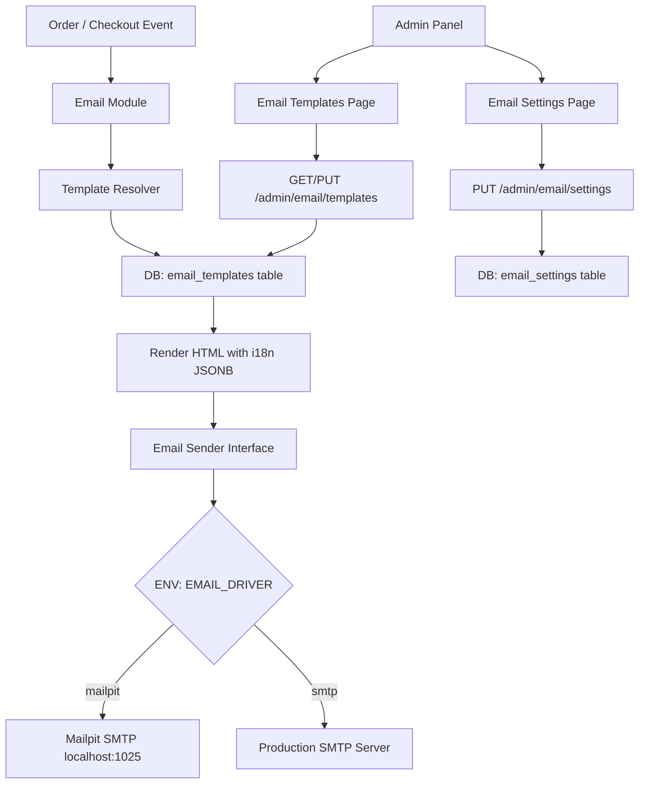

# Email Service Integration Plan

## Overview

Integrate a full email service into the Go ecommerce platform with:
- **Mailpit** for local dev/testing (SMTP trap)
- **Standard SMTP** for production
- Admin panel **Email** menu with **Settings** and **Templates** sub-pages
- Templates stored in DB with **i18n support** (LT + EN, easily extensible)

---

## Architecture Diagram



---

## Stack Decisions

- **No new Go dependencies** — use stdlib `net/smtp` for SMTP sending
- **Mailpit** added to `docker-compose.yml` (image: `axllent/mailpit`)
- **Templates** stored in PostgreSQL with `subject_i18n` and `body_html_i18n` JSONB columns (same pattern as CMS `i18n`)
- **Settings** stored in a single-row `email_settings` table (SMTP host/port/user/pass/from)
- **Driver selection** via `EMAIL_DRIVER=mailpit|smtp` env var

---

## Phase 1: Email Platform Layer

**File:** [`internal/platform/email/email.go`](internal/platform/email/email.go)

Define the `Sender` interface and two implementations:

```go
type Sender interface {
    Send(ctx context.Context, msg Message) error
}

type Message struct {
    To      string
    Subject string
    HTML    string
}
```

Implementations:
- `SMTPSender` — uses `net/smtp` with configurable host/port/user/pass/from
- `MailpitSender` — same as SMTP but pre-configured for `localhost:1025`, no auth

Factory `NewFromEnv()` reads `EMAIL_DRIVER` and returns the right sender.

---

## Phase 2: Email Storage Layer

**File:** [`internal/storage/email/store.go`](internal/storage/email/store.go)

Interfaces:
```go
type Store interface {
    GetSettings(ctx) (*Settings, error)
    SaveSettings(ctx, Settings) error
    ListTemplates(ctx) ([]Template, error)
    GetTemplate(ctx, code string) (*Template, error)
    SaveTemplate(ctx, Template) error
}
```

`Template` struct:
```go
type Template struct {
    ID           string
    Code         string          // e.g. "order_confirmation"
    Name         string          // human label
    SubjectI18n  map[string]string  // {"en": "...", "lt": "..."}
    BodyHTMLI18n map[string]string  // {"en": "...", "lt": "..."}
    UpdatedAt    time.Time
}
```

`Settings` struct:
```go
type Settings struct {
    Driver   string  // "mailpit" | "smtp"
    Host     string
    Port     int
    Username string
    Password string
    FromName string
    FromAddr string
}
```

---

## Phase 3: Database Migration

**File:** [`migrations/030_email_schema.sql`](migrations/030_email_schema.sql)

```sql
-- +goose Up

CREATE TABLE email_settings (
    id         SERIAL PRIMARY KEY,
    driver     TEXT NOT NULL DEFAULT 'mailpit',
    host       TEXT NOT NULL DEFAULT 'localhost',
    port       INT  NOT NULL DEFAULT 1025,
    username   TEXT NOT NULL DEFAULT '',
    password   TEXT NOT NULL DEFAULT '',
    from_name  TEXT NOT NULL DEFAULT 'Store',
    from_addr  TEXT NOT NULL DEFAULT 'noreply@example.com',
    updated_at TIMESTAMPTZ NOT NULL DEFAULT NOW()
);

-- Single row enforced by trigger or app logic
INSERT INTO email_settings DEFAULT VALUES;

CREATE TABLE email_templates (
    id              UUID PRIMARY KEY DEFAULT gen_random_uuid(),
    code            TEXT NOT NULL UNIQUE,
    name            TEXT NOT NULL,
    subject_i18n    JSONB NOT NULL DEFAULT '{}',
    body_html_i18n  JSONB NOT NULL DEFAULT '{}',
    updated_at      TIMESTAMPTZ NOT NULL DEFAULT NOW()
);

-- Seed default templates
INSERT INTO email_templates (code, name, subject_i18n, body_html_i18n) VALUES
(
    'order_confirmation',
    'Order Confirmation',
    '{"en": "Your order {{.OrderNumber}} is confirmed", "lt": "Jūsų užsakymas {{.OrderNumber}} patvirtintas"}',
    '{"en": "<h1>Thank you for your order!</h1><p>Order: {{.OrderNumber}}</p>", "lt": "<h1>Ačiū už užsakymą!</h1><p>Užsakymas: {{.OrderNumber}}</p>"}'
),
(
    'order_shipped',
    'Order Shipped',
    '{"en": "Your order {{.OrderNumber}} has shipped", "lt": "Jūsų užsakymas {{.OrderNumber}} išsiųstas"}',
    '{"en": "<h1>Your order is on the way!</h1>", "lt": "<h1>Jūsų užsakymas keliauja!</h1>"}'
),
(
    'password_reset',
    'Password Reset',
    '{"en": "Reset your password", "lt": "Atstatyti slaptažodį"}',
    '{"en": "<h1>Reset Password</h1><p><a href=\"{{.ResetURL}}\">Click here</a></p>", "lt": "<h1>Atstatyti slaptažodį</h1><p><a href=\"{{.ResetURL}}\">Spauskite čia</a></p>"}'
);

-- +goose Down
DROP TABLE IF EXISTS email_templates;
DROP TABLE IF EXISTS email_settings;
```

---

## Phase 4: Email Module (Admin API)

**Directory:** [`internal/modules/email/`](internal/modules/email/)

Files:
- `module.go` — `NewModule(deps)`, `Name() = "email"`, `RegisterRoutes()`
- `http.go` — HTTP handlers

### API Routes

| Method | Path | Description |
|--------|------|-------------|
| `GET` | `/admin/email/settings` | Get current SMTP settings |
| `PUT` | `/admin/email/settings` | Save SMTP settings |
| `POST` | `/admin/email/settings/test` | Send a test email |
| `GET` | `/admin/email/templates` | List all templates |
| `GET` | `/admin/email/templates/{code}` | Get single template |
| `PUT` | `/admin/email/templates/{code}` | Save template (all languages) |

### Template Rendering

Use Go's `text/template` to render body/subject with a data map:
```go
func renderTemplate(tmpl string, data map[string]any) (string, error)
```

### Email Service Interface

The module exposes a `SendEmail(ctx, code, lang, to string, data map[string]any) error` method that:
1. Loads template by `code` from DB
2. Resolves subject/body for `lang` (fallback to `en`) using same `ResolveI18n` pattern from CMS
3. Renders Go template with `data`
4. Sends via `platform/email.Sender`

---

## Phase 5: Register Module

**File:** [`cmd/api/main.go`](cmd/api/main.go)

Add:
```go
import "goecommerce/internal/modules/email"
// ...
app.RegisterModule(email.NewModule(deps))
```

---

## Phase 6: Wire Email into Checkout

**File:** [`internal/modules/checkout/order.go`](internal/modules/checkout/order.go)

After order is created, call the email module's service to send `order_confirmation`. The email module should expose a simple interface that checkout can call:

```go
type EmailService interface {
    SendOrderConfirmation(ctx context.Context, to, lang, orderNumber string) error
}
```

Pass `EmailService` as an optional dep to checkout module. If nil, skip silently.

---

## Phase 7: Frontend — Email Settings Page

**File:** [`web/app/[locale]/admin/email/settings/page.tsx`](web/app/[locale]/admin/email/settings/page.tsx)

Server component that fetches current settings, renders a client form component.

Form fields:
- Driver: `mailpit` | `smtp` (radio/select)
- Host, Port, Username, Password (shown only when driver = `smtp`)
- From Name, From Address
- "Send Test Email" button (input for test recipient + POST to `/admin/email/settings/test`)

---

## Phase 8: Frontend — Email Templates Page

**File:** [`web/app/[locale]/admin/email/templates/page.tsx`](web/app/[locale]/admin/email/templates/page.tsx)

Lists all templates. Each template row links to an edit view.

**Edit view:** [`web/app/[locale]/admin/email/templates/[code]/page.tsx`](web/app/[locale]/admin/email/templates/[code]/page.tsx)

- Tab per language: **EN** | **LT** (tabs are generated from available keys in the JSONB — easy to extend by adding a new language key)
- Each tab has: Subject input + HTML body textarea (or rich editor)
- "Copy EN → LT" button (same pattern as CMS pages)
- Save button

**Language extensibility:** The UI reads available language tabs from the template's existing keys union with a configured `SUPPORTED_LANGS` list. Adding a new language = add its key to the DB row + add to the supported langs config. No code changes needed.

---

## Phase 9: Admin Shell — Email Menu

**File:** [`web/components/admin/admin-shell.tsx`](web/components/admin/admin-shell.tsx)

Add `emailItems` array and a new collapsible "Email" section following the exact same pattern as `settingsItems`:

```tsx
const emailItems: NavItem[] = [
  { href: "/admin/email/settings", labelKey: "email_settings", icon: <Settings size={16} /> },
  { href: "/admin/email/templates", labelKey: "email_templates", icon: <Mail size={16} /> },
];
```

Add `Mail` icon import from `lucide-react`.

---

## Phase 10: i18n Keys

**Files:** [`web/i18n/messages/en.json`](web/i18n/messages/en.json) and [`web/i18n/messages/lt.json`](web/i18n/messages/lt.json)

Add to `admin.menu`:
```json
"email": "Email",
"email_settings": "Settings",
"email_templates": "Templates"
```

Add `admin.email` namespace for page labels (form fields, buttons, etc.).

---

## Phase 11: Docker — Add Mailpit

**File:** [`docker-compose.yml`](docker-compose.yml)

```yaml
mailpit:
  image: axllent/mailpit
  ports:
    - "1025:1025"   # SMTP
    - "8025:8025"   # Web UI
```

Mailpit web UI at `http://localhost:8025` for inspecting sent emails during dev.

---

## Phase 12: Environment Variables

**File:** [`.env.example`](.env.example)

```env
# Email
EMAIL_DRIVER=mailpit
EMAIL_HOST=localhost
EMAIL_PORT=1025
EMAIL_USERNAME=
EMAIL_PASSWORD=
EMAIL_FROM_NAME=Store
EMAIL_FROM_ADDR=noreply@example.com
# For prod SMTP: EMAIL_DRIVER=smtp, EMAIL_HOST=smtp.example.com, EMAIL_PORT=587
```

---

## File Summary

### New Backend Files
| File | Purpose |
|------|---------|
| `internal/platform/email/email.go` | Sender interface + SMTP/Mailpit implementations |
| `internal/storage/email/store.go` | DB access for settings + templates |
| `internal/modules/email/module.go` | Module registration |
| `internal/modules/email/http.go` | Admin API handlers |
| `migrations/030_email_schema.sql` | DB schema + seed templates |

### Modified Backend Files
| File | Change |
|------|--------|
| `cmd/api/main.go` | Register email module |
| `internal/modules/checkout/order.go` | Call email service after order creation |

### New Frontend Files
| File | Purpose |
|------|---------|
| `web/app/[locale]/admin/email/settings/page.tsx` | Settings page |
| `web/app/[locale]/admin/email/templates/page.tsx` | Templates list |
| `web/app/[locale]/admin/email/templates/[code]/page.tsx` | Template editor |
| `web/components/admin/email/email-settings-form.tsx` | Settings form client component |
| `web/components/admin/email/email-template-editor.tsx` | Template editor client component |
| `web/lib/admin-email.ts` | API client functions |

### Modified Frontend Files
| File | Change |
|------|--------|
| `web/components/admin/admin-shell.tsx` | Add Email menu section |
| `web/i18n/messages/en.json` | Add email i18n keys |
| `web/i18n/messages/lt.json` | Add email i18n keys |

### Infrastructure
| File | Change |
|------|--------|
| `docker-compose.yml` | Add Mailpit service |
| `.env.example` | Add EMAIL_* vars |

---

## Template i18n Extensibility

Templates use the same JSONB pattern as CMS:
- `subject_i18n: {"en": "...", "lt": "..."}` 
- `body_html_i18n: {"en": "...", "lt": "..."}`

To add a new language (e.g. `de`):
1. Add `"de": "..."` to the JSONB columns for each template (via admin UI or migration)
2. The admin template editor auto-discovers language tabs from existing keys
3. No code changes required

The `ResolveI18n` function from [`internal/modules/cms/i18n.go`](internal/modules/cms/i18n.go) will be reused (or moved to a shared package) for template rendering.
