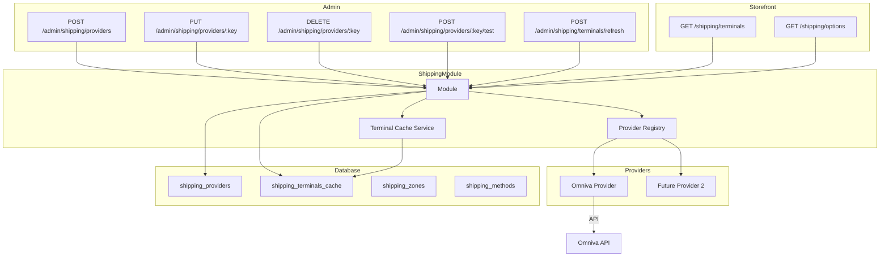

# Omniva Provider Module - Stage 1 Implementation Plan

## Executive Summary

This plan outlines the implementation of Omniva as the first shipping "provider plugin" in the Go ecommerce backend. The existing codebase already has significant infrastructure in place that we can build upon.

## Current State Analysis

### Already Implemented

| Component | Location | Status |
|-----------|----------|--------|
| Provider Interface | [`internal/platform/shipping/provider.go`](internal/platform/shipping/provider.go) | Basic interface with `ListTerminals` and `Quote` |
| Provider Registry | [`internal/shipping/registry.go`](internal/platform/shipping/registry.go) | `Register()` and `Get()` functions |
| Omniva Provider | [`internal/platform/shipping/providers/omniva/omniva.go`](internal/platform/shipping/providers/omniva/omniva.go) | Mock implementation with LT/LV/EE terminals |
| DB Tables | [`migrations/019_shipping_schema.sql`](migrations/019_shipping_schema.sql) | `shipping_providers`, `shipping_terminals_cache`, `shipping_zones`, `shipping_methods` |
| Storage Layer | [`internal/storage/shipping/`](internal/storage/shipping/store.go) | CRUD for providers, zones, methods, terminals |
| Admin API | [`internal/modules/shipping/http_admin.go`](internal/modules/shipping/http_admin.go) | Provider/Zone/Method CRUD, Terminal cache management |
| Storefront API | [`internal/modules/shipping/http_storefront.go`](internal/modules/shipping/http_storefront.go) | `/shipping/options`, `/shipping/terminals` |
| Module Loader | [`internal/modules/shipping/module.go`](internal/modules/shipping/module.go) | Loads enabled providers from DB on startup |

### Key Findings

1. **Provider Interface** - Exists but lacks capability discovery methods
2. **Omniva Provider** - Uses mock data, needs real API integration
3. **Terminal Caching** - DB storage exists, but no TTL-based refresh logic
4. **Admin Endpoints** - Missing POST for provider creation and test endpoint

---

## Implementation Plan

### Phase 1: Enhance Provider Interface

Add capability discovery methods to support future features.

**File:** [`internal/platform/shipping/provider.go`](internal/platform/shipping/provider.go)

```go
// Capabilities describes what a provider supports
type Capabilities struct {
    Terminals      bool // ListTerminals supported
    CreateShipment bool // ShipmentCreator interface
    Labels         bool // LabelProvider interface
    Tracking       bool // Tracker interface
    Pickup         bool // PickupRequester interface
}

// Provider is the base interface for shipping providers
type Provider interface {
    Key() string
    Name() string
    Capabilities() Capabilities
    ListTerminals(ctx context.Context, country string) ([]Terminal, error)
}

// QuoteProvider is an optional interface for live rate quoting
type QuoteProvider interface {
    Quote(ctx context.Context, req QuoteRequest) ([]ShippingOption, error)
}

// ShipmentCreator is an optional interface for creating shipments
type ShipmentCreator interface {
    CreateShipment(ctx context.Context, req ShipmentRequest) (*ShipmentResult, error)
}

// LabelProvider is an optional interface for label generation
type LabelProvider interface {
    GetLabel(ctx context.Context, shipmentID string) ([]byte, error)
}

// Tracker is an optional interface for shipment tracking
type Tracker interface {
    GetTracking(ctx context.Context, trackingNumber string) (*TrackingInfo, error)
}

// PickupRequester is an optional interface for courier pickup
type PickupRequester interface {
    RequestPickup(ctx context.Context, req PickupRequest) (*PickupResult, error)
}
```

---

### Phase 2: Implement Real Omniva API Client

Replace mock data with actual Omniva API integration.

**Files to create/modify:**

1. **[`internal/platform/shipping/providers/omniva/client.go`](internal/platform/shipping/providers/omniva/client.go)** - HTTP client with auth
2. **[`internal/platform/shipping/providers/omniva/terminals.go`](internal/platform/shipping/providers/omniva/terminals.go)** - Terminal fetching logic
3. **[`internal/platform/shipping/providers/omniva/provider.go`](internal/platform/shipping/providers/omniva/provider.go)** - Update to implement new interface

#### Omniva API Details

Based on Omniva integration documentation:

- **Sandbox URL:** `https://sandbox.omniva.lt/api`
- **Live URL:** `https://api.omniva.lt`
- **Authentication:** Basic auth with username/password
- **Terminals Endpoint:** XML/JSON feed of parcel machines

**Terminal Data Structure:**

```go
type omnivaTerminal struct {
    ZIP        string `json:"zip"`         // Terminal ID/code
    Name       string `json:"name"`
    Address    string `json:"address"`
    City       string `json:"city"`
    Country    string `json:"country"`     // 2-letter code
    Postcode   string `json:"postcode"`
    Latitude   string `json:"latitude"`
    Longitude  string `json:"longitude"`
    WorkingHours string `json:"working_hours"`
    Type       string `json:"type"`        // parcel_locker, post_office
}
```

---

### Phase 3: Terminal Caching with TTL

Add TTL-based cache refresh logic.

**File:** [`internal/modules/shipping/http_storefront.go`](internal/modules/shipping/http_storefront.go)

```go
const terminalsCacheTTL = 24 * time.Hour

func (m *module) getTerminals(ctx context.Context, providerKey, country string) ([]shipping.Terminal, error) {
    // Check cache first
    cached, fetchedAt, err := m.store.GetCachedTerminals(ctx, providerKey, country)
    if err == nil && len(cached) > 0 {
        // Check TTL
        if time.Since(fetchedAt) < terminalsCacheTTL {
            var terminals []shipping.Terminal
            if err := json.Unmarshal(cached, &terminals); err == nil {
                return terminals, nil
            }
        }
    }
    
    // Refresh from provider
    return m.refreshTerminals(ctx, providerKey, country)
}

func (m *module) refreshTerminals(ctx context.Context, providerKey, country string) ([]shipping.Terminal, error) {
    prov, ok := m.providers[providerKey]
    if !ok {
        return nil, fmt.Errorf("provider not found: %s", providerKey)
    }
    
    terminals, err := prov.ListTerminals(ctx, country)
    if err != nil {
        return nil, err
    }
    
    // Cache the result
    payload, _ := json.Marshal(terminals)
    _ = m.store.UpsertCachedTerminals(ctx, providerKey, country, payload)
    
    return terminals, nil
}
```

---

### Phase 4: Admin API Enhancements

#### 4.1 Add POST endpoint for creating providers

**File:** [`internal/modules/shipping/http_admin.go`](internal/modules/shipping/http_admin.go)

Add handler for `POST /admin/shipping/providers`:

```go
func (m *module) handleCreateProvider(w http.ResponseWriter, r *http.Request) {
    var req struct {
        Key        string                 `json:"key"`
        Name       string                 `json:"name"`
        Mode       string                 `json:"mode"`
        Enabled    bool                   `json:"enabled"`
        ConfigJSON map[string]interface{} `json:"config_json"`
    }
    // ... validation and creation logic
}
```

#### 4.2 Add provider test endpoint

**Endpoint:** `POST /admin/shipping/providers/:key/test`

```go
func (m *module) handleTestProvider(w http.ResponseWriter, r *http.Request, key string) {
    // 1. Get provider config from DB
    // 2. Create provider instance with config
    // 3. Test connection (e.g., fetch terminals for a country)
    // 4. Return success/error with details
}
```

---

### Phase 5: Testing

#### 5.1 Unit Tests for Terminal Normalization

**File:** [`internal/platform/shipping/providers/omniva/terminals_test.go`](internal/platform/shipping/providers/omniva/terminals_test.go)

```go
func TestNormalizeTerminal(t *testing.T) {
    input := omnivaTerminal{
        ZIP:         "12345",
        Name:        "Test Terminal",
        Address:     "Test St 1",
        City:        "Vilnius",
        Country:     "LT",
        Postcode:    "01103",
        Latitude:    "54.6872",
        Longitude:   "25.2797",
        WorkingHours: "08:00-20:00",
    }
    
    result := normalizeTerminal(input)
    
    if result.ID != "12345" {
        t.Errorf("expected ID 12345, got %s", result.ID)
    }
    // ... more assertions
}
```

#### 5.2 Cache TTL Tests

**File:** [`internal/modules/shipping/http_storefront_test.go`](internal/modules/shipping/http_storefront_test.go)

```go
func TestTerminalsCacheTTL(t *testing.T) {
    // Test that cached terminals are returned when within TTL
    // Test that terminals are refreshed when TTL expired
}
```

---

## File Changes Summary

| File | Action | Description |
|------|--------|-------------|
| `internal/platform/shipping/provider.go` | Modify | Add `Key()`, `Name()`, `Capabilities()` methods and optional interfaces |
| `internal/platform/shipping/providers/omniva/client.go` | Create | HTTP client with basic auth |
| `internal/platform/shipping/providers/omniva/terminals.go` | Create | Real API terminal fetching |
| `internal/platform/shipping/providers/omniva/provider.go` | Modify | Implement new interface methods |
| `internal/modules/shipping/http_admin.go` | Modify | Add POST provider, test endpoint |
| `internal/modules/shipping/http_storefront.go` | Modify | Add TTL-based cache logic |
| `internal/platform/shipping/providers/omniva/terminals_test.go` | Create | Unit tests for normalization |
| `internal/modules/shipping/http_storefront_test.go` | Modify | Add cache TTL tests |

---

## API Endpoints Summary

### Admin Endpoints

| Method | Path | Description |
|--------|------|-------------|
| GET | `/admin/shipping/providers` | List all providers |
| POST | `/admin/shipping/providers` | Create new provider |
| PUT | `/admin/shipping/providers/:key` | Update provider |
| DELETE | `/admin/shipping/providers/:key` | Delete provider |
| POST | `/admin/shipping/providers/:key/test` | Test provider connection |
| GET | `/admin/shipping/terminals` | Get cached terminals |
| POST | `/admin/shipping/terminals/refresh` | Force refresh terminals |
| DELETE | `/admin/shipping/terminals` | Clear terminal cache |

### Storefront Endpoints

| Method | Path | Description |
|--------|------|-------------|
| GET | `/shipping/terminals?provider=omniva&country=LT` | Get terminals (with TTL cache) |
| GET | `/shipping/options?country=LT&cart_value=1000` | Get shipping options |

---

## Architecture Diagram



---

## Implementation Order

1. **Provider Interface Enhancement** - Add capability methods
2. **Omniva Client Implementation** - Real API integration
3. **Terminal Caching TTL** - 24-hour refresh logic
4. **Admin API Enhancements** - POST and test endpoints
5. **Testing** - Unit and integration tests

---

## Notes

- The existing mock terminals can be kept as fallback for development/testing
- Omniva API credentials should be stored in `config_json` column
- Consider adding a `last_error` field to track provider issues
- Future stages will implement `CreateShipment`, `Labels`, `Tracking`, `Pickup`
