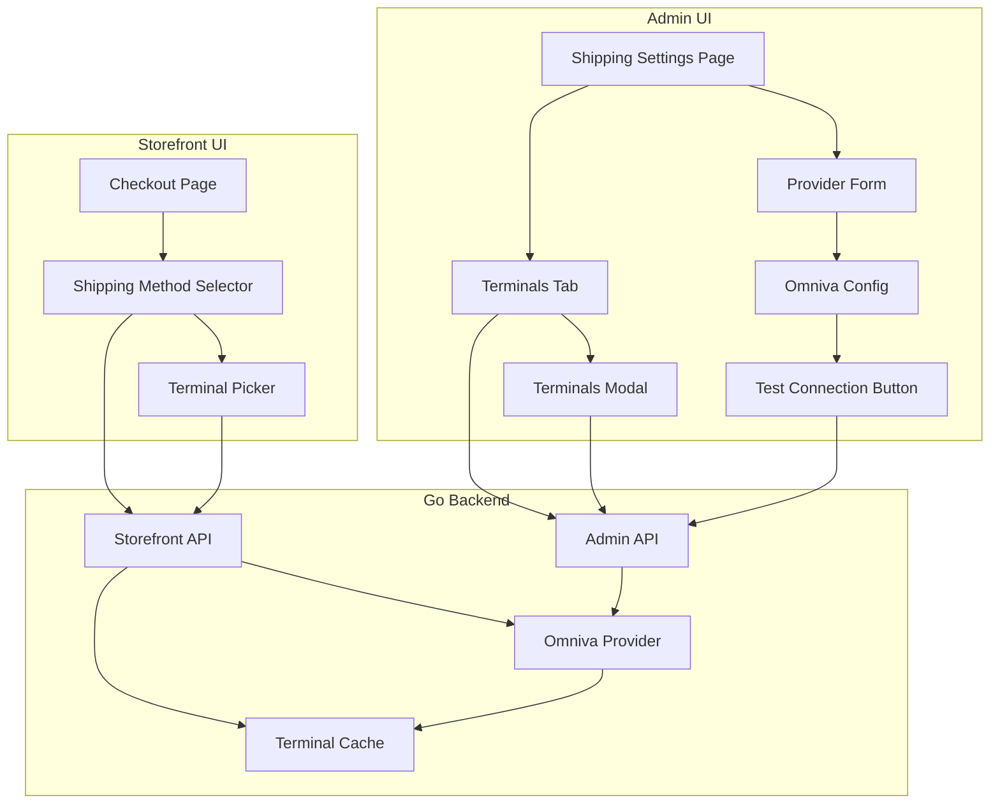

# Omniva Provider Module - Stage 2: Web UI Implementation Plan

## Executive Summary

This plan outlines Stage 2 of the Omniva shipping integration: the Web UI components for both Admin and Storefront. Stage 1 (backend API) is already implemented.

## Current State Analysis

### Stage 1 - Already Implemented (Backend)

| Component | Location | Status |
|-----------|----------|--------|
| Provider Interface | [`internal/platform/shipping/provider.go`](internal/platform/shipping/provider.go) | Complete with capabilities |
| Provider Registry | [`internal/platform/shipping/registry.go`](internal/platform/shipping/registry.go) | Complete |
| Omniva Provider | [`internal/platform/shipping/providers/omniva/`](internal/platform/shipping/providers/omniva/omniva.go) | Complete with mock + real API |
| DB Tables | [`migrations/019_shipping_schema.sql`](migrations/019_shipping_schema.sql) | Complete |
| Storage Layer | [`internal/storage/shipping/`](internal/storage/shipping/store.go) | Complete |
| Admin API | [`internal/modules/shipping/http_admin.go`](internal/modules/shipping/http_admin.go) | Complete |
| Storefront API | [`internal/modules/shipping/http_storefront.go`](internal/modules/shipping/http_storefront.go) | Complete with TTL cache |
| Tests | Various `*_test.go` files | Complete |

### Existing Admin UI Components

| Component | Location | Description |
|-----------|----------|-------------|
| Shipping Settings Page | [`web/app/admin/settings/shipping/page.tsx`](web/app/admin/settings/shipping/page.tsx) | Main page with tabs |
| Settings Tabs | [`web/components/admin/shipping/shipping-settings-tabs.tsx`](web/components/admin/shipping/shipping-settings-tabs.tsx) | Providers/Zones/Methods/Terminals tabs |
| Provider Form | [`web/components/admin/shipping/provider-form.tsx`](web/components/admin/shipping/provider-form.tsx) | Generic provider edit drawer |
| Providers List | [`web/components/admin/shipping/providers-list.tsx`](web/components/admin/shipping/providers-list.tsx) | Provider management list |
| Terminals List | [`web/components/admin/shipping/terminals-list.tsx`](web/components/admin/shipping/terminals-list.tsx) | Terminal cache manager |
| API Functions | [`web/lib/api.ts`](web/lib/api.ts) | Shipping API functions |

### Existing Storefront Components

| Component | Location | Description |
|-----------|----------|-------------|
| Checkout Page | [`web/app/checkout/page.tsx`](web/app/checkout/page.tsx) | Simple checkout with payment redirect |
| Cart | Various in `web/components/` | Cart functionality exists |

---

## Stage 2 Implementation Plan

### Phase 1: Admin - Omniva Provider Config Drawer

Enhance the provider form with Omniva-specific configuration UI.

#### 1.1 Provider-Specific Config Components

Create provider-specific configuration components that render based on provider key.

**File:** `web/components/admin/shipping/provider-configs/omniva-config.tsx`

```tsx
// Omniva-specific configuration form
// - Username field (masked in display)
// - Password field (masked)
// - Mode selector (sandbox/live)
// - Test Connection button
```

**File:** `web/components/admin/shipping/provider-configs/index.tsx`

```tsx
// Registry of provider-specific configs
// Falls back to generic JSON editor for unknown providers
```

#### 1.2 Test Connection Feature

Add backend endpoint and frontend button to test Omniva credentials.

**Backend:** Add to [`internal/modules/shipping/http_admin.go`](internal/modules/shipping/http_admin.go)

```
POST /admin/shipping/providers/:key/test
```

Response:
```json
{
  "success": true,
  "message": "Connection successful",
  "terminals_found": 245
}
```

**Frontend:** Add test button to provider form that calls the endpoint.

#### 1.3 Enhanced Provider Form

Modify [`web/components/admin/shipping/provider-form.tsx`](web/components/admin/shipping/provider-form.tsx):

- Detect provider key and render appropriate config component
- Add "Test Connection" button for providers that support it
- Show connection status indicator
- Mask sensitive fields (passwords, API keys)

---

### Phase 2: Admin - Terminals Tab Enhancement

Enhance the terminals management UI with better search and display.

#### 2.1 Terminal Search and Filtering

Enhance [`web/components/admin/shipping/terminals-list.tsx`](web/components/admin/shipping/terminals-list.tsx):

- Add search input to filter by city/name
- Show terminal count per country in provider selector
- Display last refresh timestamp prominently
- Add "View Terminals" modal to see actual terminal data

#### 2.2 Terminal Data Modal

**File:** `web/components/admin/shipping/terminals-modal.tsx`

```tsx
// Modal showing terminal details:
// - Searchable table
// - Columns: ID, Name, City, Address, Hours
// - Export to CSV button
// - Refresh button
```

---

### Phase 3: Storefront - Checkout Terminal Selection

Add terminal picker to checkout when shipping method requires it.

#### 3.1 Shipping Method Selection Component

**File:** `web/components/checkout/shipping-method-selector.tsx`

```tsx
// Component for selecting shipping method
// - Fetches options from /shipping/options?country=LT
// - Displays methods with prices
// - Shows terminal picker for parcel locker methods
```

#### 3.2 Terminal Picker Component

**File:** `web/components/checkout/terminal-picker.tsx`

The terminal picker follows Omniva's standard UX pattern used in their plugin manuals for other platforms.

##### Features

**Core Features (Required):**
- Country selector (auto-filled from shipping address)
- City filter dropdown (populated from terminal data)
- Search input (filters by name, address, postcode)
- Terminal list with:
  - Name
  - Address
  - Working hours
  - Distance from customer (if coordinates available)

**Enhanced Features (Recommended):**
- Map view with terminal markers
- "Nearest" sort option
- Selected terminal highlight on map
- Click-to-select on map markers

##### Distance Calculation

Distance is calculated using the Haversine formula when customer coordinates are available:

```typescript
// web/lib/geo.ts
function haversineDistance(
  lat1: number, lon1: number,
  lat2: number, lon2: number
): number {
  const R = 6371; // Earth's radius in km
  const dLat = toRad(lat2 - lat1);
  const dLon = toRad(lon2 - lon1);
  const a = Math.sin(dLat/2) * Math.sin(dLat/2) +
            Math.cos(toRad(lat1)) * Math.cos(toRad(lat2)) *
            Math.sin(dLon/2) * Math.sin(dLon/2);
  const c = 2 * Math.atan2(Math.sqrt(a), Math.sqrt(1-a));
  return R * c;
}

function toRad(deg: number): number {
  return deg * (Math.PI / 180);
}
```

##### Customer Location Sources

1. **Browser Geolocation API** (with permission)
   ```typescript
   navigator.geolocation.getCurrentPosition(
     (position) => {
       setCustomerLocation({
         lat: position.coords.latitude,
         lon: position.coords.longitude
       });
     },
     (error) => {
       // Fall back to address-based or manual selection
     }
   );
   ```

2. **Shipping Address Geocoding**
   - Use a geocoding service (e.g., Nominatim, Google Maps)
   - Called when address is entered/changed
   - Cached in session

3. **Manual Selection**
   - User browses list without distance sorting
   - City filter helps narrow down options

##### Map View Implementation

**Option A: Leaflet (Open Source, No API Key)**
```typescript
// Using react-leaflet
import { MapContainer, TileLayer, Marker, Popup } from 'react-leaflet';

// Free tile layer
const tileUrl = 'https://{s}.tile.openstreetmap.org/{z}/{x}/{y}.png';
```

**Option B: Google Maps (Requires API Key)**
```typescript
// Using @react-google-maps/api
import { GoogleMap, Marker } from '@react-google-maps/api';
```

**Recommendation:** Use Leaflet with OpenStreetMap tiles for zero-cost implementation.

##### Component Structure

```tsx
interface TerminalPickerProps {
  provider: string;
  country: string;
  selectedTerminalId?: string;
  onSelect: (terminal: Terminal) => void;
  customerLocation?: { lat: number; lon: number };
}

function TerminalPicker({
  provider,
  country,
  selectedTerminalId,
  onSelect,
  customerLocation
}: TerminalPickerProps) {
  const [view, setView] = useState<'list' | 'map'>('list');
  const [cityFilter, setCityFilter] = useState<string>('');
  const [searchQuery, setSearchQuery] = useState<string>('');
  const [sortBy, setSortBy] = useState<'name' | 'distance'>('distance');
  
  // Fetch terminals
  const { terminals, cities, isLoading } = useTerminals(provider, country);
  
  // Filter and sort terminals
  const filteredTerminals = useMemo(() => {
    let result = terminals;
    
    // City filter
    if (cityFilter) {
      result = result.filter(t => t.city === cityFilter);
    }
    
    // Search filter
    if (searchQuery) {
      const query = searchQuery.toLowerCase();
      result = result.filter(t => 
        t.name.toLowerCase().includes(query) ||
        t.address.toLowerCase().includes(query) ||
        t.postcode.includes(query)
      );
    }
    
    // Sort
    if (sortBy === 'distance' && customerLocation) {
      result = [...result].sort((a, b) => {
        const distA = haversineDistance(
          customerLocation.lat, customerLocation.lon,
          a.lat, a.lon
        );
        const distB = haversineDistance(
          customerLocation.lat, customerLocation.lon,
          b.lat, b.lon
        );
        return distA - distB;
      });
    } else {
      result = [...result].sort((a, b) => a.name.localeCompare(b.name));
    }
    
    return result;
  }, [terminals, cityFilter, searchQuery, sortBy, customerLocation]);
  
  return (
    <div className="terminal-picker">
      {/* Filters */}
      <div className="flex gap-2 mb-4">
        <CityFilter cities={cities} value={cityFilter} onChange={setCityFilter} />
        <SearchInput value={searchQuery} onChange={setSearchQuery} />
        <ViewToggle value={view} onChange={setView} />
      </div>
      
      {/* Sort toggle (only if location available) */}
      {customerLocation && (
        <SortToggle value={sortBy} onChange={setSortBy} />
      )}
      
      {/* Content */}
      {view === 'list' ? (
        <TerminalList
          terminals={filteredTerminals}
          selectedId={selectedTerminalId}
          onSelect={onSelect}
          customerLocation={customerLocation}
        />
      ) : (
        <TerminalMap
          terminals={filteredTerminals}
          selectedId={selectedTerminalId}
          onSelect={onSelect}
          customerLocation={customerLocation}
        />
      )}
    </div>
  );
}
```

##### Terminal List Item

```tsx
function TerminalListItem({
  terminal,
  isSelected,
  onSelect,
  distance
}: {
  terminal: Terminal;
  isSelected: boolean;
  onSelect: () => void;
  distance?: number;
}) {
  return (
    <button
      onClick={onSelect}
      className={cn(
        "w-full text-left p-4 rounded-lg border transition-colors",
        isSelected
          ? "border-blue-500 bg-blue-50 dark:bg-blue-950"
          : "border-surface-border hover:bg-foreground/5"
      )}
    >
      <div className="flex justify-between items-start">
        <div>
          <h4 className="font-medium">{terminal.name}</h4>
          <p className="text-sm text-foreground/70">{terminal.address}</p>
          <p className="text-xs text-foreground/50 mt-1">
            {terminal.hours}
          </p>
        </div>
        {distance !== undefined && (
          <span className="text-sm font-medium text-foreground/70">
            {distance.toFixed(1)} km
          </span>
        )}
      </div>
    </button>
  );
}
```

##### Map View Component

```tsx
function TerminalMap({
  terminals,
  selectedId,
  onSelect,
  customerLocation
}: TerminalMapProps) {
  const mapCenter = customerLocation || {
    lat: terminals[0]?.lat || 54.6872,
    lon: terminals[0]?.lon || 25.2797
  };
  
  return (
    <MapContainer
      center={[mapCenter.lat, mapCenter.lon]}
      zoom={12}
      className="h-96 w-full rounded-lg"
    >
      <TileLayer
        url="https://{s}.tile.openstreetmap.org/{z}/{x}/{y}.png"
        attribution="© OpenStreetMap contributors"
      />
      
      {/* Customer location marker */}
      {customerLocation && (
        <Marker
          position={[customerLocation.lat, customerLocation.lon]}
          icon={customerIcon}
        >
          <Popup>Your location</Popup>
        </Marker>
      )}
      
      {/* Terminal markers */}
      {terminals.map(terminal => (
        <Marker
          key={terminal.id}
          position={[terminal.lat, terminal.lon]}
          icon={terminal.id === selectedId ? selectedIcon : defaultIcon}
          eventHandlers={{
            click: () => onSelect(terminal)
          }}
        >
          <Popup>
            <div className="text-sm">
              <strong>{terminal.name}</strong><br />
              {terminal.address}<br />
              <em>{terminal.hours}</em>
            </div>
          </Popup>
        </Marker>
      ))}
    </MapContainer>
  );
}
```

#### 3.3 Enhanced Checkout Page

Modify [`web/app/checkout/page.tsx`](web/app/checkout/page.tsx):

- Add shipping method selection before payment
- Show terminal picker when parcel locker selected
- Store selected terminal ID in order

---

### Phase 4: Backend Enhancements for Checkout

Minor backend additions to support checkout flow.

#### 4.1 Shipping Method Capabilities

Add `requires_terminal` flag to shipping method response.

**Modify:** [`internal/modules/shipping/http_storefront.go`](internal/modules/shipping/http_storefront.go)

```go
type methodDTO struct {
    // ... existing fields
    RequiresTerminal bool `json:"requires_terminal"`
}
```

#### 4.2 Terminal Search Endpoint

Add search/filter to terminals endpoint.

```
GET /shipping/terminals?provider=omniva&country=LT&city=Vilnius&search=centras
```

---

## File Changes Summary

### New Files

| File | Description |
|------|-------------|
| `web/components/admin/shipping/provider-configs/omniva-config.tsx` | Omniva-specific config form |
| `web/components/admin/shipping/provider-configs/index.tsx` | Provider config registry |
| `web/components/admin/shipping/terminals-modal.tsx` | Terminal details modal |
| `web/components/checkout/shipping-method-selector.tsx` | Shipping method selection |
| `web/components/checkout/terminal-picker.tsx` | Terminal selection UI with list/map views |
| `web/components/checkout/terminal-list.tsx` | Terminal list component |
| `web/components/checkout/terminal-map.tsx` | Leaflet map view component |
| `web/lib/geo.ts` | Haversine distance calculation utilities |
| `web/hooks/use-terminals.ts` | Hook for fetching and caching terminals |
| `web/hooks/use-customer-location.ts` | Hook for browser geolocation |

### Modified Files

| File | Changes |
|------|---------|
| `web/components/admin/shipping/provider-form.tsx` | Add provider-specific configs, test button |
| `web/components/admin/shipping/terminals-list.tsx` | Add search, view modal |
| `web/app/checkout/page.tsx` | Add shipping selection, terminal picker |
| `web/lib/api.ts` | Add test connection, terminal search functions |
| `internal/modules/shipping/http_admin.go` | Add test endpoint |
| `internal/modules/shipping/http_storefront.go` | Add requires_terminal, search params |

---

## API Endpoints Summary

### Admin Endpoints (New)

| Method | Path | Description |
|--------|------|-------------|
| POST | `/admin/shipping/providers/:key/test` | Test provider connection |

### Storefront Endpoints (Enhanced)

| Method | Path | Description |
|--------|------|-------------|
| GET | `/shipping/options?country=LT` | Get shipping options with `requires_terminal` flag |
| GET | `/shipping/terminals?provider=omniva&country=LT&city=Vilnius&search=centras` | Get terminals with search |

---

## Architecture Diagram



---

## Implementation Order

1. **Admin - Provider Config Enhancement**
   - Create Omniva config component
   - Add test connection endpoint
   - Integrate into provider form

2. **Admin - Terminals Tab Enhancement**
   - Add search/filter to terminals list
   - Create terminals modal
   - Add export functionality

3. **Storefront - Terminal Picker Foundation**
   - Create geo utilities (Haversine distance)
   - Create useTerminals hook
   - Create useCustomerLocation hook
   - Create terminal list component

4. **Storefront - Terminal Picker Advanced**
   - Add map view with Leaflet
   - Implement distance sorting
   - Add city filter and search

5. **Storefront - Checkout Integration**
   - Create shipping method selector
   - Integrate terminal picker
   - Update checkout page

6. **Backend Enhancements**
   - Add `requires_terminal` to method response
   - Add search params to terminals endpoint

## Dependencies

### Frontend Dependencies (npm)

```json
{
  "dependencies": {
    "react-leaflet": "^4.2.1",
    "leaflet": "^1.9.4"
  },
  "devDependencies": {
    "@types/leaflet": "^1.9.8"
  }
}
```

### No Additional Backend Dependencies

The backend already has all required dependencies from Stage 1.

---

## UI/UX Considerations

### Admin UI

- Use existing shadcn/ui and JolyUI patterns
- Mask sensitive fields (passwords, API keys)
- Show clear success/error states for test connection
- Provide helpful error messages for configuration issues

### Storefront UI

- Mobile-first responsive design
- Fast terminal search (debounced input)
- Clear visual distinction between terminal types
- Accessible keyboard navigation

---

## Testing Checklist

### Admin UI Tests

- [ ] Provider config saves correctly
- [ ] Test connection shows success/failure
- [ ] Terminals load and refresh correctly
- [ ] Search filters terminals properly

### Storefront UI Tests

- [ ] Shipping methods load for country
- [ ] Terminal picker shows for parcel locker methods
- [ ] Terminal search works correctly
- [ ] Selected terminal saves with order

---

## Notes

- The existing mock terminals in Omniva provider can be used for development
- Real Omniva API credentials should be stored in DB `config_json` column
- Terminal cache TTL is 24 hours (configurable)
- Consider adding terminal coordinates for map view in future
